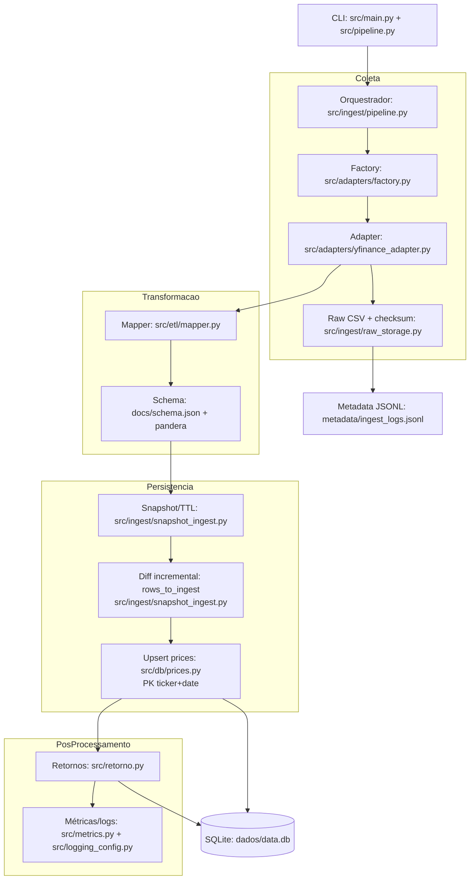
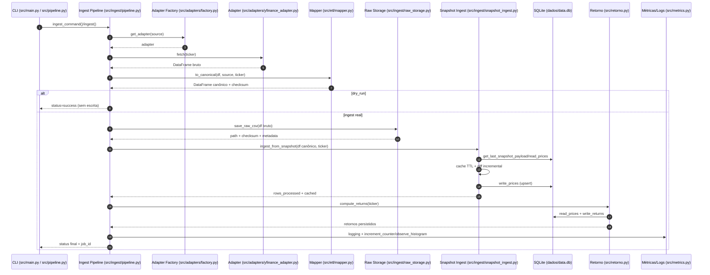

## Diagrama do Fluxo de Dados

**Legenda curta**

- **Coleta:** adapters e scripts buscam dados externos e salvam CSVs em `raw/` ou `snapshots/`.
- **Validação:** checagem de formato e checksums; entradas inválidas são rejeitadas.
- **ETL:** pipeline transforma e enriquece os dados (normalização, tipos, cálculos).
- **Persistência:** gravação idempotente em SQLite via `src/db_client.py` e migrations em `migrations/`.
- **Orquestração:** CLI e testes acionam e validam o fluxo.
- **Saída:** métricas, relatórios e artefatos gerados em `outputs/` e `reports/`.

---

---

## Sequência Temporal (Ingestão)

